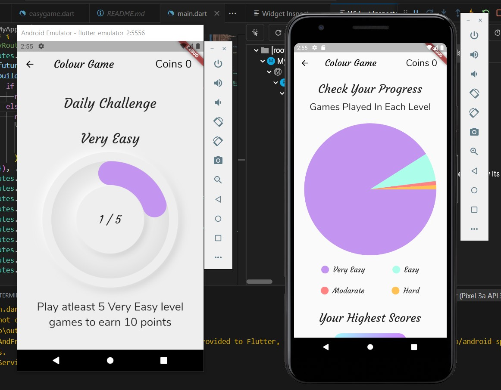

## Colour Game 

A fun game which confuse your mind try easy and hard level games 
--

### Features
* A good Colourfull UI
* Analysis of the game performence with a graphs
* 4 diffrent levels
* A timer with circular progress indicator
* Earn points by completing daily challenges
* Use the points to increase the time available for the game

-------

----------
## Getting Started

This project is a starting point for a Flutter application.

A few resources to get you started if this is your first Flutter project:

- [Lab: Write your first Flutter app](https://flutter.dev/docs/get-started/codelab)
- [Cookbook: Useful Flutter samples](https://flutter.dev/docs/cookbook)

For help getting started with Flutter, view our
[online documentation](https://flutter.dev/docs), which offers tutorials,
samples, guidance on mobile development, and a full API reference.
